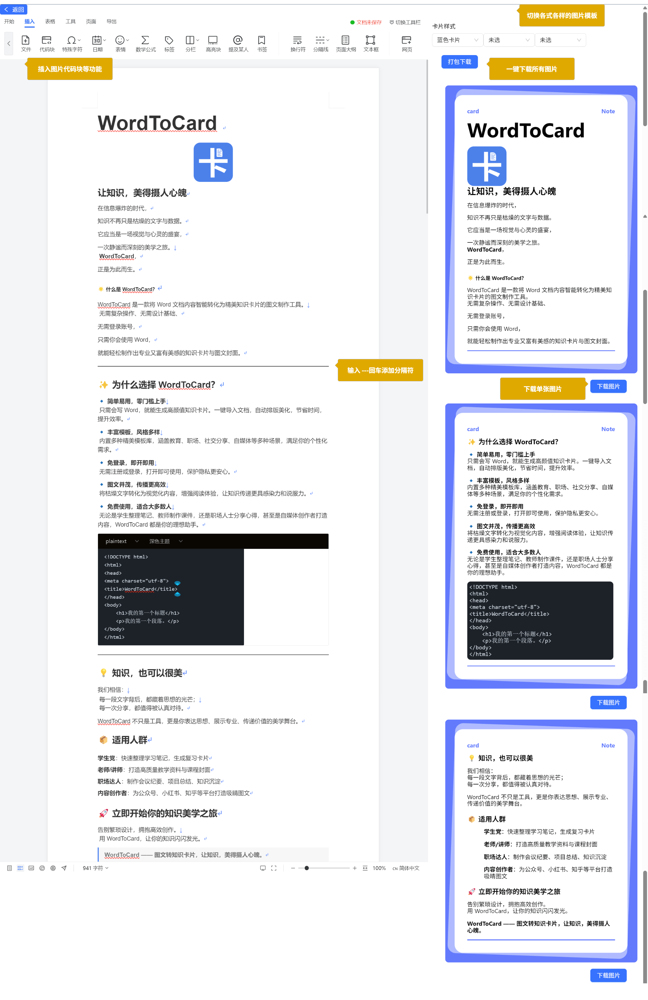

**wordtocard-open —— 将 Word 转为知识卡片的开源工具**（此版本为开源版本和官网版本有所不同请仔细甄别）

在信息纷繁的时代，知识不只是文字的堆砌，也可以是结构清晰、形式美观的视觉表达。  
**WordToCard** 是一个开源项目，旨在帮助用户将 Word 文档内容快速转换为图文并茂的知识卡片与封面。

---

### 🌟 项目简介

WordToCard 是一个基于 Word 的内容转化工具，支持将文档内容自动排版为结构化、美观的知识卡片。无需设计经验，只需熟悉 Word 操作，即可生成高质量图文内容，适用于教学、学习、分享等多个场景。

---

### ✨ 核心特点

- **简单易用**：无需专业设计技能，会写 Word 就能上手。
- **一键导出**：支持将 Word 内容自动转化为图文卡片，提升内容呈现效率。
- **模板丰富**：提供多种可扩展的卡片模板，适应不同使用场景。
- **本地优先**：免登录、保护隐私，适合本地或私有部署使用。
- **开源开放**：欢迎贡献代码、模板或建议，共同完善项目生态。
---

### 💡 适用人群

- **学生**：整理笔记、制作复习卡片
- **教师**：输出课件、知识点总结
- **职场人士**：撰写报告、会议纪要
- **内容创作者**：打造公众号、社交平台图文素材

---

### 🧩 技术架构（可选说明）

本项目采用前后端分离架构，前端支持 Web 或桌面应用，后端解析 Word 文件并进行样式映射。模板系统可扩展，便于社区共建共享。

---

### 🚀 加入我们

wordtocard-open 是一个持续成长的开源项目，欢迎你一起参与开发、优化模板、撰写文档或提出宝贵建议。

官网：https://www.wordtocard.com/
项目愿景：让每个人都能轻松地将知识变得更有条理、更具美感。

> **WordToCard-Open —— 图文转知识卡片，让知识表达更优雅。**

MIT License

Copyright (c) 2025, wordtocard-open

Permission is hereby granted, free of charge,

to any person obtaining a copy of this software and associated
documentation files (the "Software"),
to deal in the Software without restriction,
including without limitation the rights to use, copy,
modify, merge, publish, distribute, sublicense,
and/or sell copies of the Software,
and to permit persons to whom the Software is furnished to do so,
subject to the following conditions:

The above copyright notice and this
permission notice shall be included in all copies or substantial portions of the Software.

THE SOFTWARE IS PROVIDED "AS IS", WITHOUT WARRANTY OF ANY KIND,
EXPRESS OR IMPLIED, INCLUDING BUT NOT LIMITED TO THE WARRANTIES OF MERCHANTABILITY,
FITNESS FOR A PARTICULAR PURPOSE AND NONINFRINGEMENT.
IN NO EVENT SHALL THE AUTHORS OR COPYRIGHT HOLDERS BE LIABLE FOR ANY CLAIM,
DAMAGES OR OTHER LIABILITY, WHETHER IN AN ACTION OF CONTRACT, TORT OR OTHERWISE,
ARISING FROM,
OUT OF OR IN CONNECTION WITH THE SOFTWARE OR THE USE OR OTHER DEALINGS IN THE SOFTWARE.
